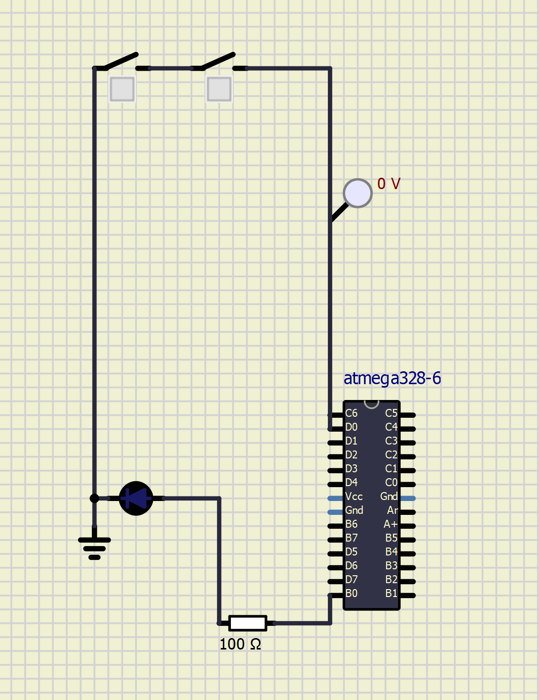
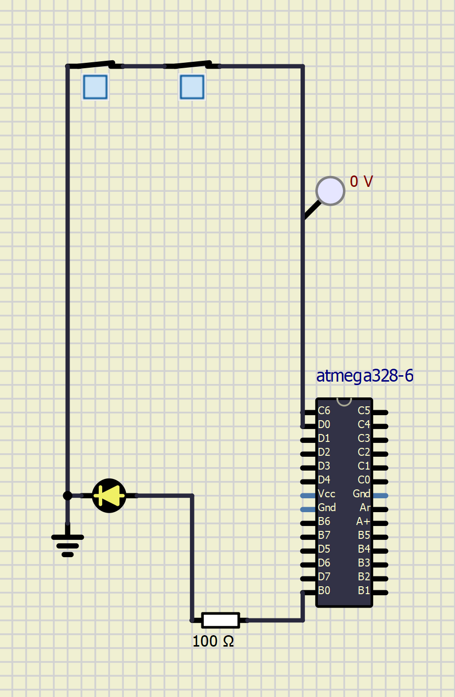

# Embedded C Programming Examples with Continuous Integration and Code Quality

# LED Blinking 

## In Action

|ON|OFF|
|:--:|:--:|
|||

#### CI and Code Quality

|Build|Cppcheck|Codacy|
|:--:|:--:|:--:|
|[|||

## Wiki Documentation
* System [SETUP](https://github.com/Bharathgopal/Emb-C/wiki)

